# Purplebase Architecture

Purplebase is a high-performance, local-first Nostr client library for Dart that provides a concrete implementation of the [Models](../models) framework. It offers SQLite-based local storage, optimized WebSocket relay communication, and advanced performance features like caching, throttling, and background processing.

## Overview

Purplebase extends the Models framework by providing:
- **PurplebaseStorageNotifier**: A SQLite-based storage implementation
- **WebSocketPool**: Optimized relay communication with connection pooling
- **Isolate Architecture**: Background processing to keep the UI responsive
- **Performance Optimizations**: Caching, throttling, and request optimization

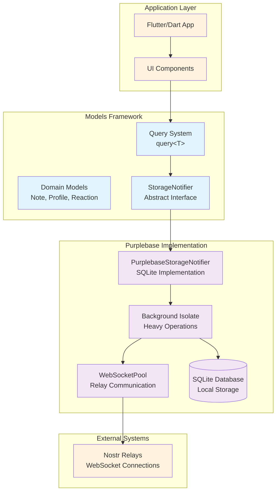

## Core Components

### 1. Storage Layer Architecture

Purplebase implements the Models `StorageNotifier` interface with SQLite backend and isolate-based processing:

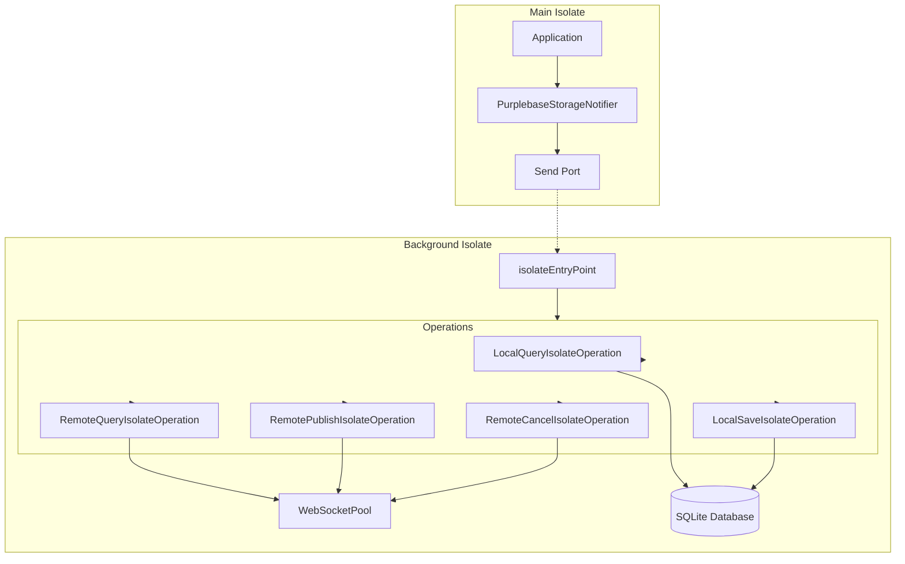

### 2. WebSocket Pool

The WebSocket pool manages connections to Nostr relays with advanced optimization features:

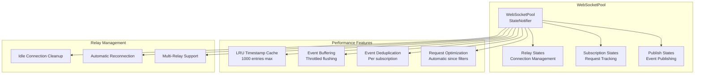

### 3. Database Schema

SQLite database optimized for Nostr event storage with compression and indexing:

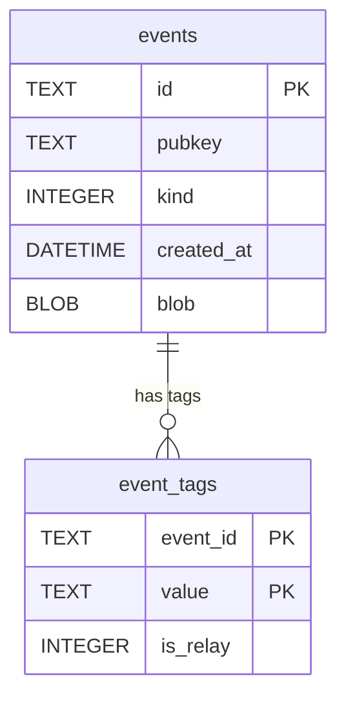

**Schema Notes:**
- **events table**: Primary key is event ID, indexed on pubkey/kind/created_at, blob contains compressed content/tags/signature
- **event_tags table**: Composite primary key (event_id + value), indexed on value, is_relay: 0=tag, 1=relay_url

## Data Flow Patterns

### 1. Query Flow

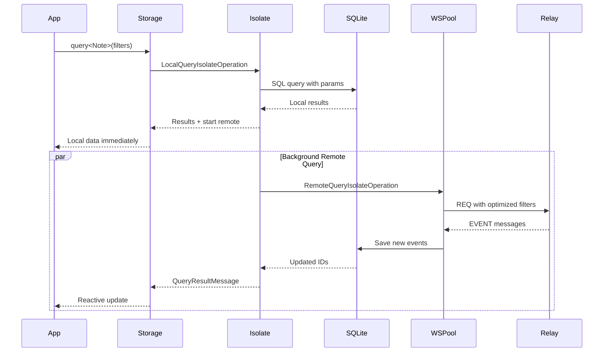

### 2. Event Publishing Flow

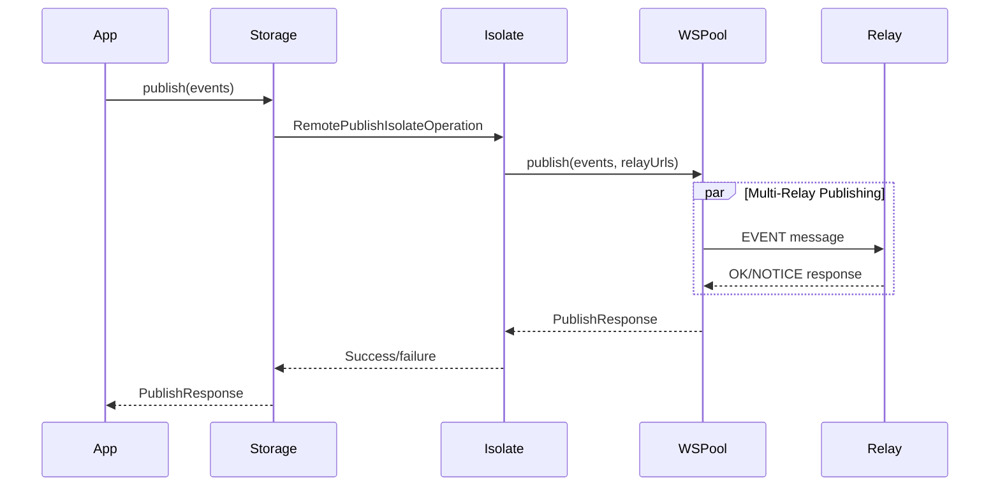

### 3. Real-time Updates

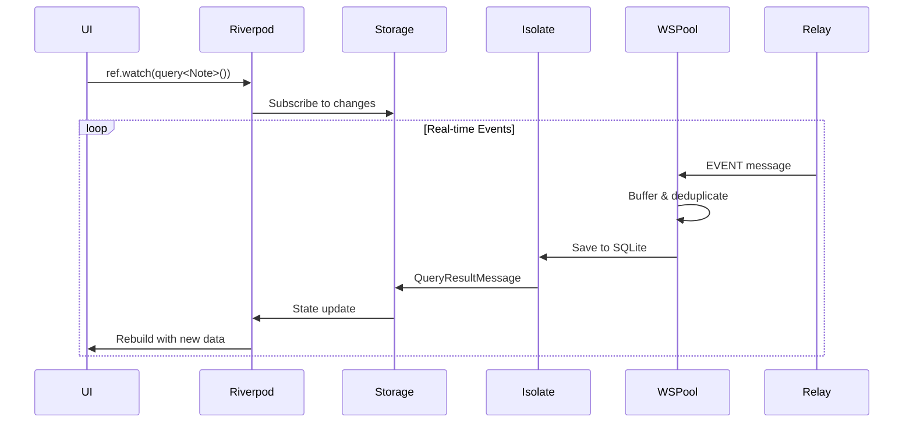

## Performance Optimizations

### 1. Request Optimization

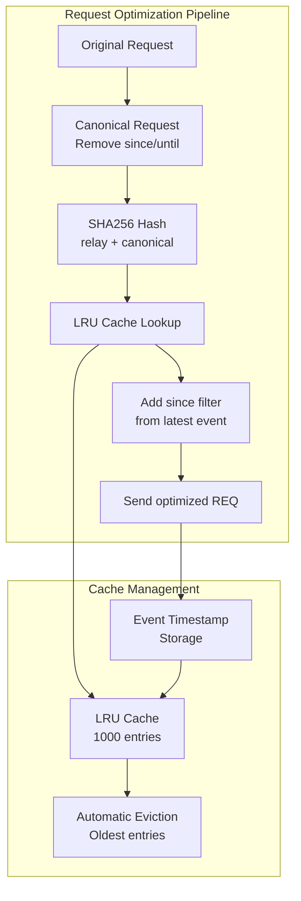

### 2. Event Buffering & Throttling

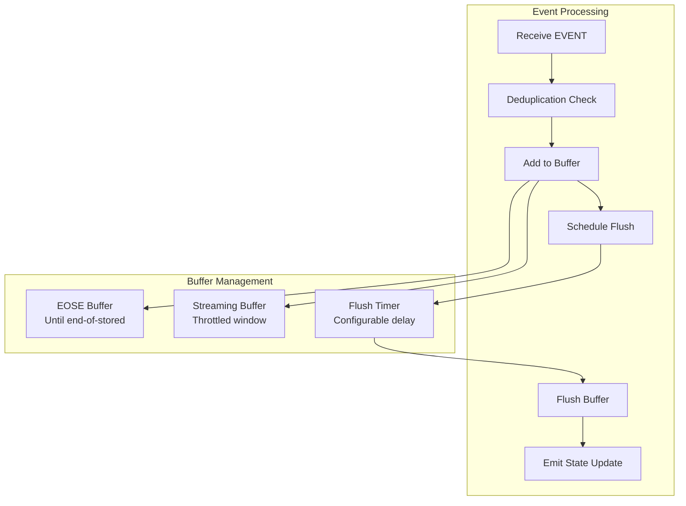

### 3. Database Optimizations

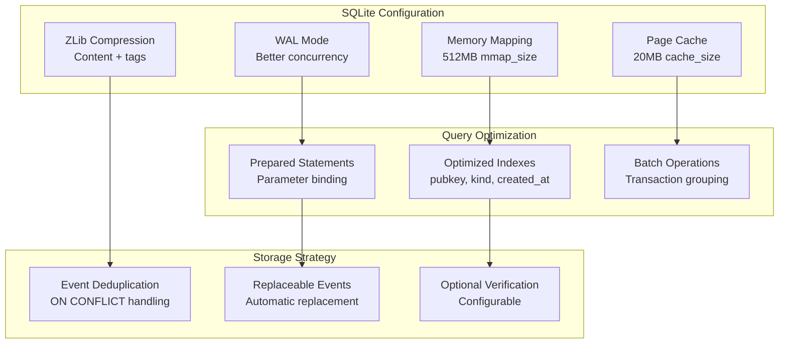

## Configuration & Customization

### 1. Storage Configuration

```dart
final config = StorageConfiguration(
  databasePath: 'nostr.db',
  skipVerification: false,
  keepSignatures: true,
  
  // Relay configuration
  relayGroups: {
    'primary': {'wss://relay1.com', 'wss://relay2.com'},
    'backup': {'wss://relay3.com'},
  },
  defaultRelayGroup: 'primary',
  
  // Performance tuning
  responseTimeout: Duration(seconds: 10),
  streamingBufferWindow: Duration(milliseconds: 300),
  idleTimeout: Duration(minutes: 5),
);
```

### 2. Relay Groups

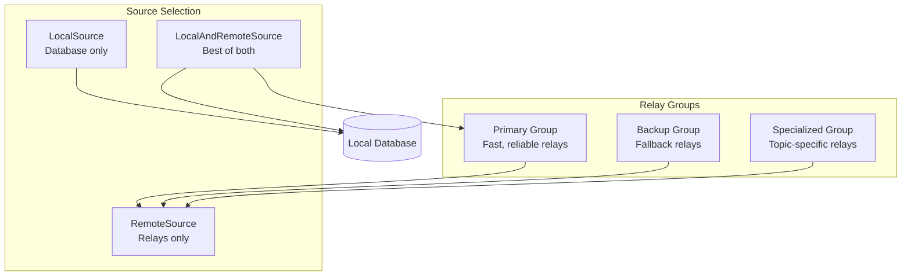

## Testing & Development

### 1. Testing Architecture

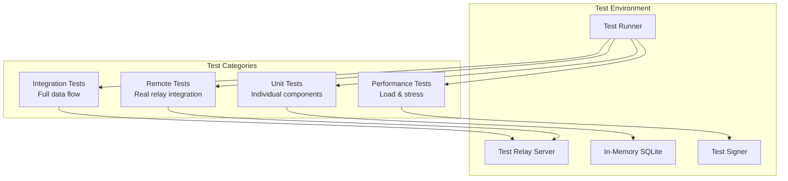

### 2. Development Features

- **Hot Reload**: Preserves database state during development
- **Logging**: Comprehensive debug information via InfoNotifier
- **Metrics**: Performance monitoring and optimization insights
- **Debugging**: Isolate-safe debugging with proper error handling

## Best Practices

### 1. Query Optimization

```dart
// ✅ Good: Specific filters reduce relay load
final notes = await storage.query<Note>(
  authors: {specificPubkey},
  kinds: {1}, // Text notes only
  since: DateTime.now().subtract(Duration(hours: 24)),
  limit: 50,
);

// ❌ Bad: Broad queries are expensive
final allNotes = await storage.query<Note>();
```

### 2. Background Processing

```dart
// ✅ Good: Use background source for non-critical updates
final backgroundNotes = query<Note>(
  authors: {pubkey},
  source: RemoteSource(background: true),
);

// ✅ Good: Combine local and remote for immediate + fresh data
final hybridNotes = query<Note>(
  authors: {pubkey},
  source: LocalAndRemoteSource(),
);
```

### 3. Memory Management

```dart
// ✅ Good: Use streaming for large datasets
final stream = query<Note>(
  kinds: {1},
  limit: 1000,
  source: RemoteSource(stream: true),
);

// ✅ Good: Cancel subscriptions when done
await storage.cancel(request);
```

## Performance Characteristics

- **Local Queries**: < 10ms typical response time
- **Remote Queries**: 100-500ms initial response, then streaming
- **Event Processing**: 10,000+ events/second throughput
- **Memory Usage**: ~50MB for 100k events (with compression)
- **Database Size**: ~20MB for 100k events (compressed)

## Monitoring & Debugging

### 1. Info System

```dart
// Listen to debug information
ref.listen(infoNotifierProvider, (_, message) {
  if (message != null) {
    print('Purplebase: ${message.message}');
  }
});
```

### 2. Performance Metrics

The system provides built-in performance monitoring:
- Connection status and latency
- Query execution times
- Cache hit rates
- Event processing throughput
- Database statistics

---

This architecture provides a robust, scalable foundation for building high-performance Nostr applications while maintaining the simplicity and reactivity of the Models framework. 